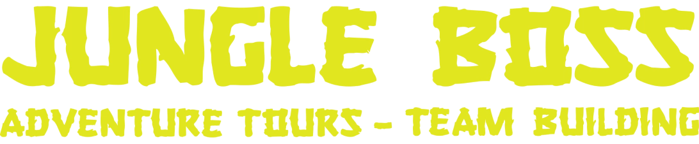

# GoTravel - Travel Adventure Platform

GoTravel là một nền tảng du lịch mạo hiểm được phát triển với công nghệ Next.js, Typescript và Tailwind CSS. Dự án này cung cấp giao diện đa ngôn ngữ (tiếng Anh và tiếng Việt) và được thiết kế để giúp người dùng khám phá và đặt các tour du lịch mạo hiểm trên toàn thế giới.



## Tính năng chính

- **Đa ngôn ngữ**: Hỗ trợ tiếng Anh và tiếng Việt
- **Giao diện người dùng hiện đại**: Được thiết kế với Tailwind CSS
- **Tour du lịch mạo hiểm**: Hiển thị và tìm kiếm các tour du lịch
- **Trang quản trị**: Quản lý tour, đơn đặt hàng và người dùng
- **Responsive**: Hiển thị tốt trên desktop và mobile

## Công nghệ sử dụng

- **Frontend**: Next.js 15, React 19, Tailwind CSS 4
- **Quản lý trạng thái**: React Query (Tanstack Query)
- **Đa ngôn ngữ**: next-intl
- **Slider/Carousel**: Swiper

## Cài đặt và Chạy dự án

### Yêu cầu

- Node.js phiên bản 18 trở lên
- npm hoặc yarn

### Các bước cài đặt

1. Clone dự án:
```bash
git clone https://github.com/linhngocdao/GoTravel.git
cd GoTravel
```

2. Cài đặt các thư viện:
```bash
npm install
# hoặc
yarn install
```

3. Chạy dự án trong môi trường phát triển:
```bash
npm run dev
# hoặc
yarn dev
```

4. Truy cập dự án tại [http://localhost:3000](http://localhost:3000)

## Cấu trúc dự án

- `src/app/[locale]/`: Định tuyến đa ngôn ngữ
- `src/components/`: Các component của dự án
- `messages/`: File ngôn ngữ (Tiếng Anh và Tiếng Việt)
- `public/`: Tài nguyên tĩnh (hình ảnh, font)

## Triển khai

Dự án có thể được triển khai lên Vercel hoặc bất kỳ nền tảng nào hỗ trợ Next.js:

```bash
npm run build
npm run start
```

## Liên hệ

Nếu bạn có bất kỳ câu hỏi hoặc góp ý nào, vui lòng liên hệ qua email hoặc tạo issue trên Github.
